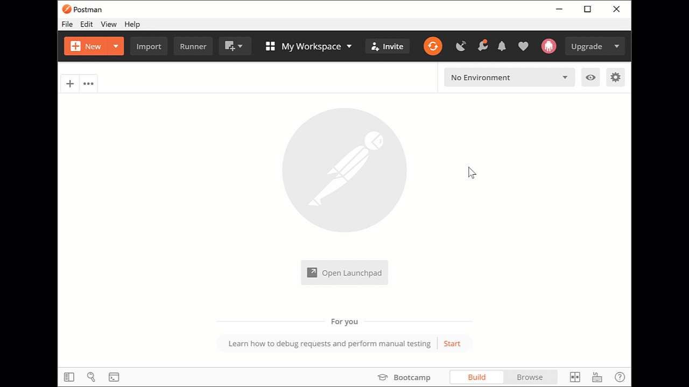
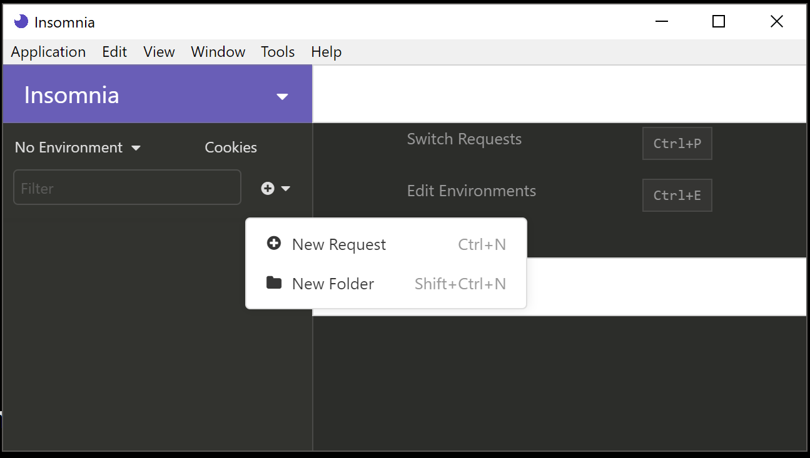
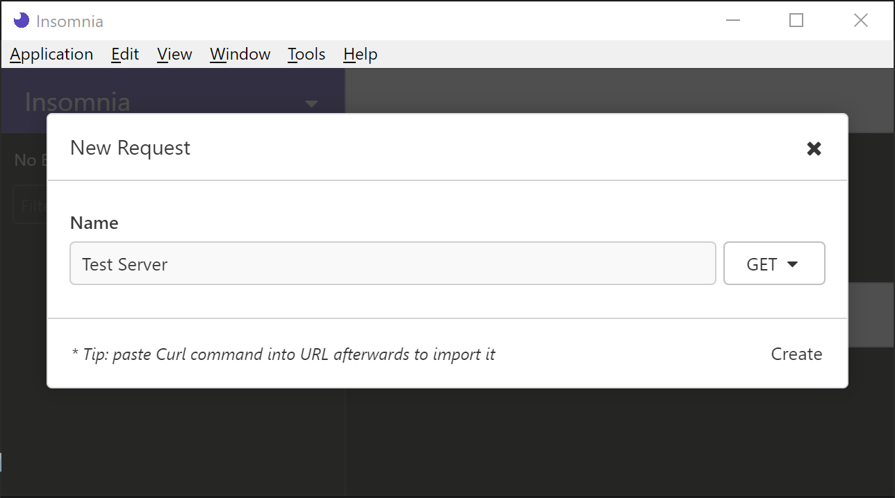
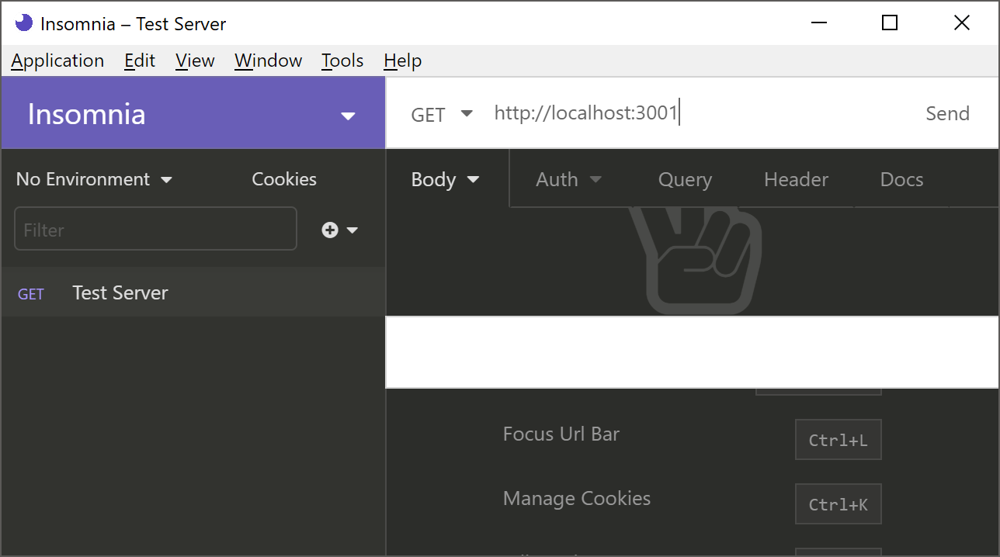
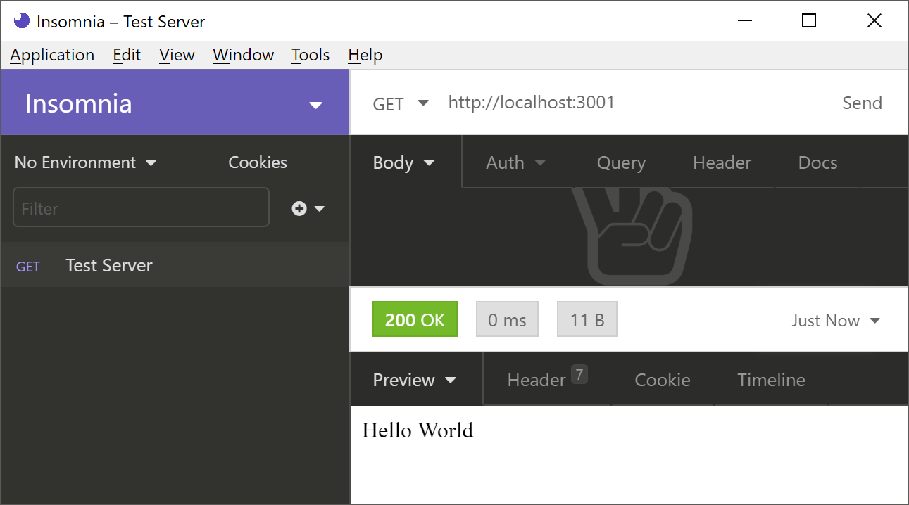
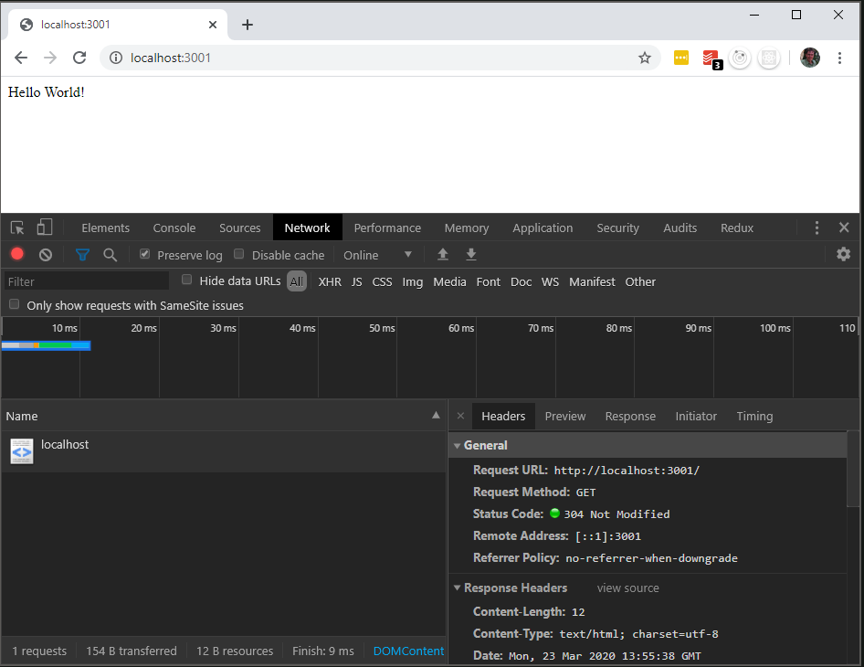
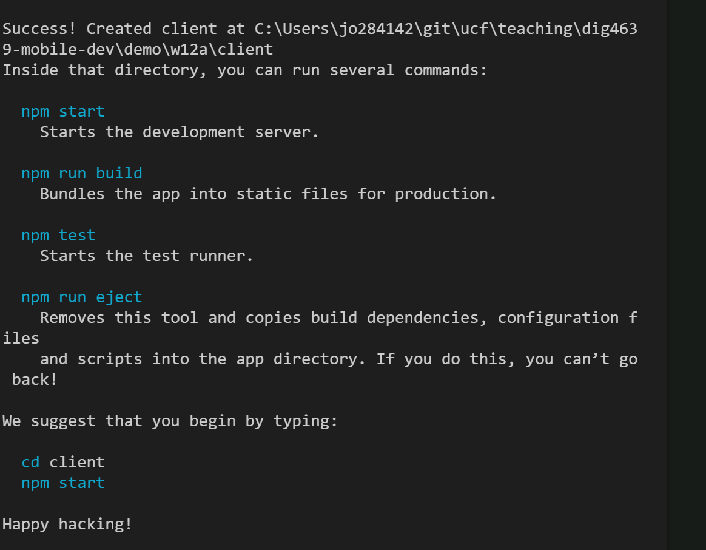

# Week 12A Demo
## Introduction
This week we will be going over how to consume JSON data from a server.

## Learning Objectives
 - Understand how servers return information using the HTTP method `GET`
 - Use software to explore the JSON return values from API endpoints
 - Experiment with how the `Promise` class works to handle asynchronous code
 - See examples of `async`/`await` syntax for placing asynchronous code in synchronous syntax.
 
## Procedure
Follow along by completing the following steps in order. Some steps have alternatives.

### 1. Setup
#### Pulling from Class Repository
<details open>
  <summary> (Recommended) If pulling from Class Repository:</summary>

  1. Ensure your local repository has a remote repository reference named "class"
  ```bash
  git remote -v
  ```

  2. Open a terminal in the `demo/w12a/server` directory and type "npm install" and press return
  3. Do the same for `demo/w12a/client`
</details>

#### Setting Up By Hand
<details>
  <summary> If not pulling from Class Repository:</summary>

  1. Create a new directory in your repository: demo/w12b
  2. Create a folder named "server"
  3. Open a terminal in that directory and type "npm init" and return
  4. Install express. "npm install express"
  5. Add the following code to the file 

  ```javascript
  // Simple Express Hello World found here: https://expressjs.com/en/starter/hello-world.html
  const express = require('express')
  const app = express()
  const port = 3001

  app.get('/', (req, res) => res.send('Hello World!'))

  app.listen(port, () => console.log(`Example app listening on port ${port}!`))
  ```

  6. Return to the root of w12a, and create a react app in the "client" directory:

  ```bash
  cd ..
  npx create-react-app client
  ```

</details>

#### API Explorer Software Installation
1. Install one of the following REST API explorers:
  - [Postman](https://www.postman.com/product/api-client)
  - [Insomnia](https://insomnia.rest/)

### 2. Start the server
  Open a single terminal in VSCode and navigate to the `demo/w12a/server` subfolder:

  ```bash
  cd demo/w12a/server
  node index.js
  ```

  Output:

  ```bash
  Example app listening on port 3001!
  ``` 

### 3. Request `/` from `localhost:3001`

Use a REST Explorer (Postman or Insomnia) to make a request using the `GET` method  to `localhost:3001`:
#### Postman

<details><summary>Option 1: Create a new request using Postman</summary>

1. Create a basic request. 



2. `GET` is the default request for Postman, so just provide the location of the server:


This way you can see the content (in the form of a string) from our server on port 3001.

</details>

#### Insomnia

<details open><summary>Option 2: Create a new request using Insomnia</summary>

1. First, click the "+" next to the filter and select "New Request (Ctrl+N)".

  

2. Next, fill in the name of the request (I used "Test Server"). This will appear on the left.

  

Press Create or Return

3. Enter the address of the server endpoint you wish to test in the address bar. 

  

4. Press return or click the "Send" button. This will make the request. The detailed headers, response value, and cookies are available below.

  

</details>

#### In Browser

<details open><summary>Using Chrome Developer Tools</summary>

In order to use Chrome, you must first activate the developer tools, and then refresh the page with the endpoint in the address bar. This will work for most public APIs that don't require API keys or basic authentication.


</details>

## Create a React app to act as client
1. Create a new react app in the client directory:
```bash
npx create-react-app client
```
You should see the following as output:
>
>  

2. 

## 