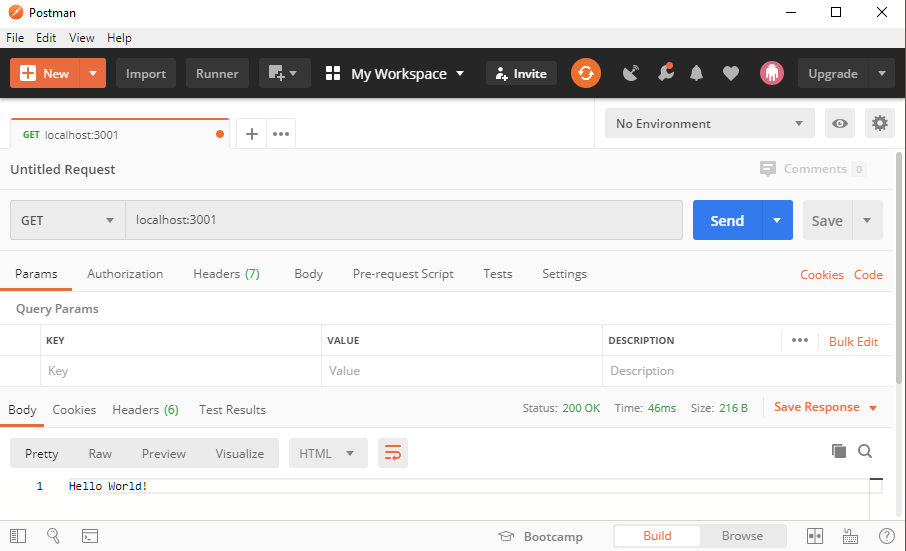

# Week 12A Demo
## Introduction

## Learning Objectives
 - Understand how servers return information using the HTTP method `GET`
 - Use software to explore the JSON return values from API endpoints
 - Experiment with how the `Promise` class works to handle asynchronous code
 - See examples of `async`/`await` syntax for placing asynchronous code in synchronous syntax.
## Procedure
### 1. Setup
<details>
<summary> Setup if not pulling from Class Repository</summary>
1. Create a new directory in your repository: demo/w12b
2. Create a folder named "server"
3. Open a terminal in that directory and type "npm init" and return
4. Install express. "npm install express"
5. Add the following code to the file 

    ```javascript
    // Simple Express Hello World found here: https://expressjs.com/en/starter/hello-world.html
    const express = require('express')
    const app = express()
    const port = 3001

    app.get('/', (req, res) => res.send('Hello World!'))

    app.listen(port, () => console.log(`Example app listening on port ${port}!`))
    ```
</details>

### 2. API Explorer Software Installation
1. Install [Postman](https://www.postman.com/product/api-client)
2. Start the server:
    ```bash
    node index.js
    ```
    Output:
    ```bash
    Example app listening on port 3001!
    ```
### 3. Request `/` from `localhost:3001`
Use Postman to initiate a request using the `GET` method  to `localhost:3001`:
<details><summary>Postman</summary>


</details>

Use Insomnia:

Use a Chrome Developer Tools to examine navigating to localhost:3001:
<details><summary>Screenshot of Chrome</summary>


</details>

## Create a simple React app to act as client
1. Create a new react app in the client directory:
```bash
npx create-react-app client
```
You should see the following as output:
>
>  


